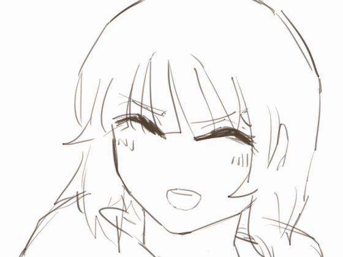

##

 

 

  <h2 align="middle">:wave: YOYO I'm Lee :heart: Enjoy visiting my profile </h2>	  

   

 ###### 🔊🎧🎵 Now I'm listening to ... 

		

## What am I doing?
Just messing around~	

<a href="https://sharemygame.com/@Abyzz/project-boost">Play my game

	

	<h2 align="middle">Contact me 📞</h2>

    
<!--
**CharliezXx/CharliezXx** is a ✨ _special_ ✨ repository because its `README.md` (this file) appears on your GitHub profile.

Here are some ideas to get you started:

- 🔭 I’m currently working on ...
- 🌱 I’m currently learning ...
- 👯 I’m looking to collaborate on ...
- 🤔 I’m looking for help with ...
- 💬 Ask me about ...
- 📫 How to reach me: ...
- 😄 Pronouns: ...
- ⚡ Fun fact: ...
--> 
