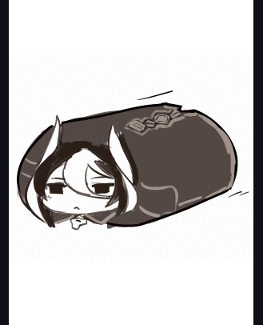

 <h3 align="left"> 💢💖 Smol Ozen , My beloved 💖💢 </h3>
 
 

   

  <h2 align="middle">:wave: YOYO I'm Lee :heart: Enjoy visiting my profile </h2>	  

   
   
> I'm studying in Thailand, and interested in coding but i'm just a newbie xD 
 and I also like to play games some kind of sandbox , survival
 and I usually listen to music but it's kinda random XD 
 so yeah feel free to contact me  I really like to know someone new!   
	
----------

 ###### 🔊🎧🎵 Now I'm listening to ... 
 
	
<h4 align="left">	
  <a href="https://cowfee-gt.tumblr.com/post/165344350607/just-an-ozen-pillar-crawling-your-feed">⬅️ Creator of this art</a> | Inspired by ➡️ <a href="https://github.com/staciax">STACIA</a>
	
-----------

## What am I doing?
	
|   👨‍💻  I'm currently learning about ...     |     🕹️  I also do this in my free time ...    |
|-------------------------------------------------|---------------------------------------------------|
|  👨‍🔧Engineering , 💻C# ,  🎮Unity3D , 🚀Blender       |   ✒️Draw , 🖋️Paint , 🎮Play games     |

<a href="https://sharemygame.com/@Abyzz/project-boost">Play my game
## Stats

 

	

	<h2 align="middle">Contact me 📞</h2>

    
<!--
**CharliezXx/CharliezXx** is a ✨ _special_ ✨ repository because its `README.md` (this file) appears on your GitHub profile.

Here are some ideas to get you started:

- 🔭 I’m currently working on ...
- 🌱 I’m currently learning ...
- 👯 I’m looking to collaborate on ...
- 🤔 I’m looking for help with ...
- 💬 Ask me about ...
- 📫 How to reach me: ...
- 😄 Pronouns: ...
- ⚡ Fun fact: ...
-->
